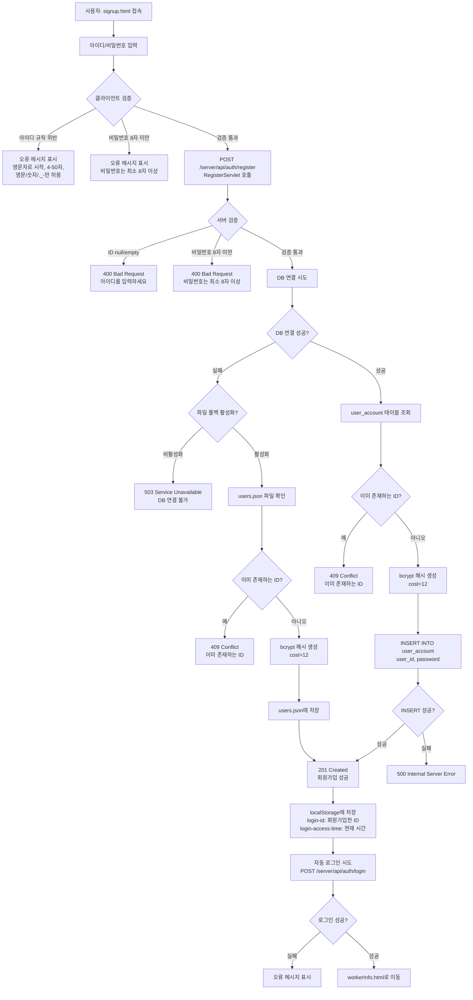
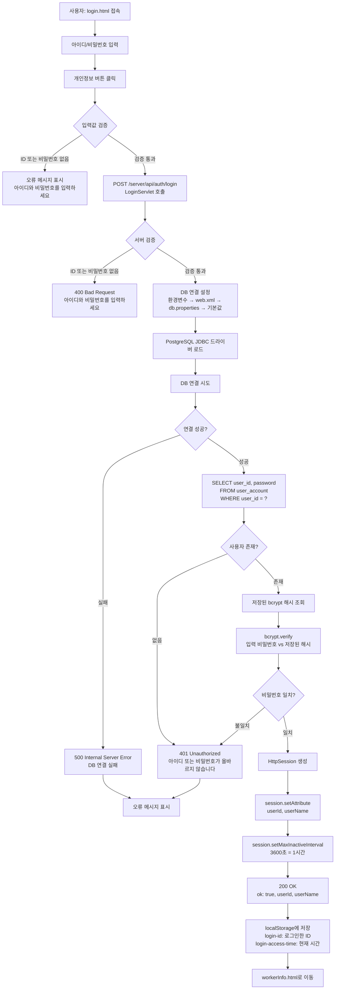
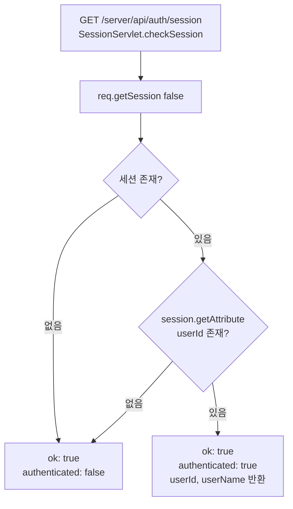
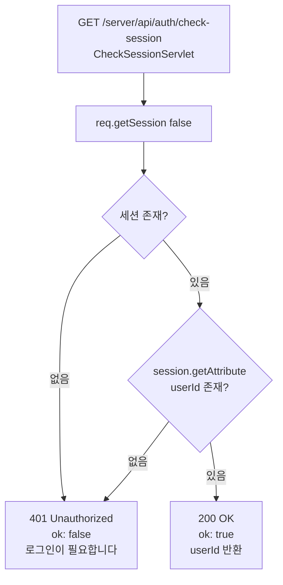
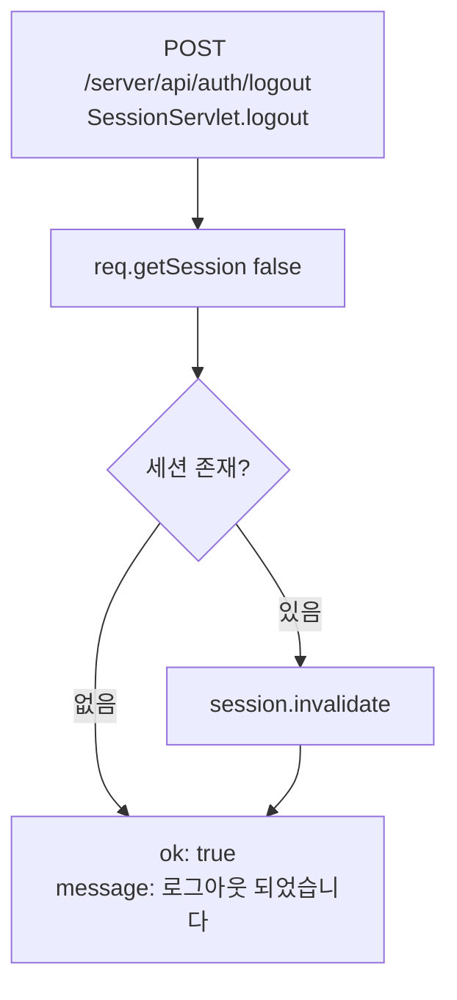
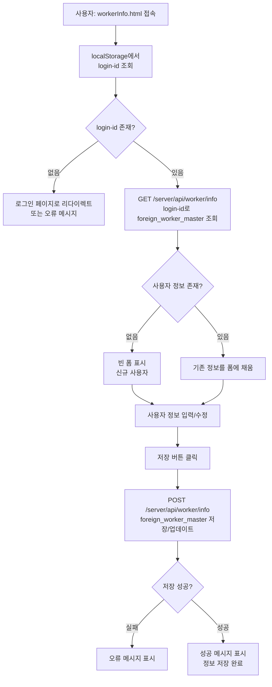
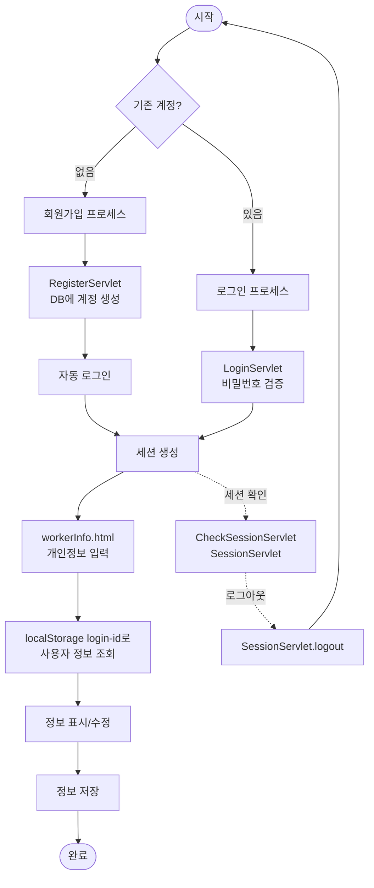

# 가입 및 인증 절차 업무 처리 흐름도

## 1. 회원가입 프로세스



## 2. 로그인 프로세스



## 3. 세션 관리 프로세스

### 3.1 세션 확인



### 3.2 세션 확인 (CheckSessionServlet)



### 3.3 로그아웃



## 4. 개인정보 입력 프로세스



## 5. 전체 인증 흐름 통합도



## 6. 주요 컴포넌트 및 역할

### 6.1 클라이언트 측 (HTML/JavaScript)

| 파일 | 역할 |
|------|------|
| `signup.html` | 회원가입 폼, 아이디/비밀번호 검증, RegisterServlet 호출, localStorage 저장 |
| `login.html` | 로그인 폼, LoginServlet 호출, localStorage 저장, workerInfo.html 이동 |
| `workerInfo.html` | localStorage의 login-id로 사용자 정보 조회 및 표시, 정보 저장 |

### 6.2 서버 측 (Java Servlet)

| 서블릿 | 엔드포인트 | 역할 |
|--------|-----------|------|
| `RegisterServlet` | `POST /server/api/auth/register` | 회원가입 처리, bcrypt 해시 생성, DB 저장 |
| `LoginServlet` | `POST /server/api/auth/login` | 로그인 처리, bcrypt 검증, 세션 생성 |
| `SessionServlet` | `GET /server/api/auth/session`<br/>`POST /server/api/auth/logout` | 세션 확인, 로그아웃 |
| `CheckSessionServlet` | `GET /server/api/auth/check-session` | 세션 상태 확인 (401 반환) |

### 6.3 데이터베이스

| 테이블 | 컬럼 | 역할 |
|--------|------|------|
| `user_account` | `user_id` (PK), `password` (bcrypt 해시), `created_at` | 사용자 계정 정보, 인증 정보 저장 |
| `foreign_worker_master` | `login_id` (FK), 기타 개인정보 필드 | 외국인 근로자 개인정보 저장 |

## 7. 보안 고려사항

1. **비밀번호 해싱**: bcrypt 사용 (cost=12)
2. **세션 관리**: HttpSession 사용, 1시간 만료
3. **클라이언트 저장**: localStorage에 login-id만 저장 (비밀번호 저장 안 함)
4. **입력 검증**: 클라이언트 및 서버 양쪽에서 검증
5. **SQL Injection 방지**: PreparedStatement 사용
6. **에러 메시지**: 민감한 정보 노출 방지

## 8. 에러 처리

| HTTP 상태 코드 | 상황 | 메시지 |
|---------------|------|--------|
| 400 | 입력값 누락/검증 실패 | "아이디를 입력하세요" / "비밀번호는 최소 8자 이상" |
| 401 | 인증 실패 | "아이디 또는 비밀번호가 올바르지 않습니다" |
| 409 | 중복 ID | "이미 존재하는 ID입니다" |
| 500 | 서버 내부 오류 | "서버 내부 오류(데이터베이스)" |
| 503 | DB 연결 불가 | "데이터베이스에 연결할 수 없습니다" |

## 9. 데이터 흐름

```
회원가입:
signup.html → RegisterServlet → PostgreSQL (user_account) → localStorage → 자동 로그인 → workerInfo.html

로그인:
login.html → LoginServlet → PostgreSQL (user_account) → HttpSession → localStorage → workerInfo.html

개인정보 조회:
workerInfo.html → localStorage (login-id) → WorkerInfoServlet → PostgreSQL (foreign_worker_master) → 화면 표시
```

