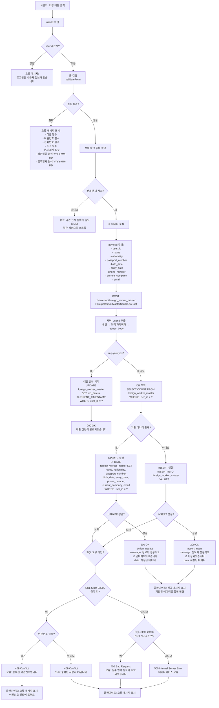
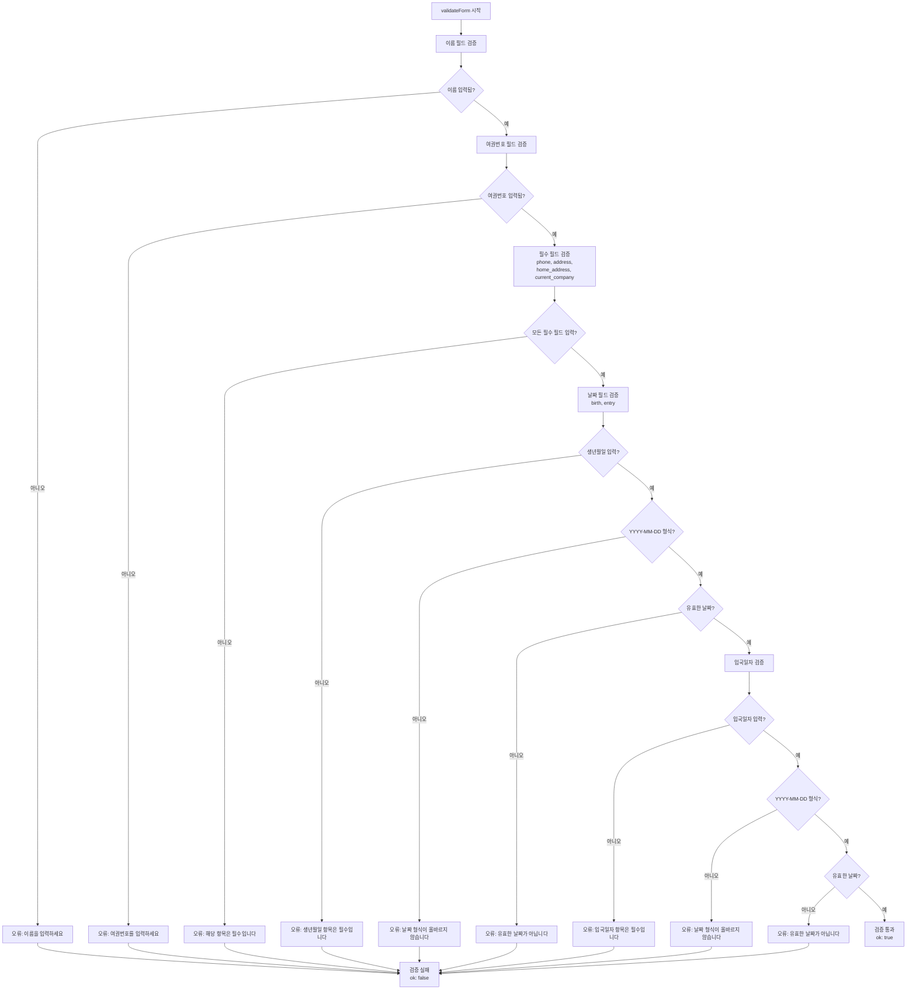
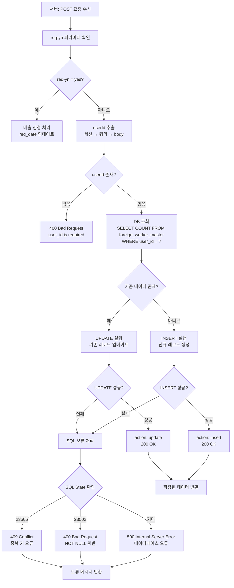
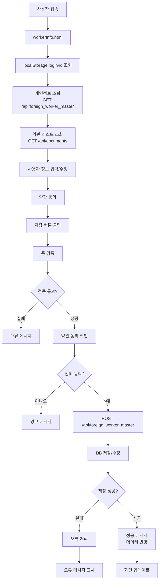

# 고객별 수신 데이터 관리 업무 처리 흐름도

## 1. 개인정보 조회 프로세스

```mermaid
flowchart TD
    A[사용자: workerInfo.html 접속] --> B[페이지 초기화<br/>initializePage]
    B --> C[localStorage에서<br/>login-id 조회]
    C --> D{login-id 존재?}
    D -->|없음| E[로그인 페이지로 리다이렉트]
    D -->|있음| F[login-id를 userId 필드에 설정]
    
    F --> G[GET /server/api/foreign_worker_master<br/>?login-id={loginId}<br/>ForeignWorkerMasterServlet.doGet]
    G --> H[서버: userId 추출<br/>세션 → 쿼리 파라미터]
    
    H --> I[DB 조회<br/>SELECT FROM foreign_worker_master<br/>WHERE user_id = ?]
    I --> J{데이터 존재?}
    
    J -->|있음| K[200 OK<br/>ok: true, found: true<br/>data: 개인정보 객체]
    J -->|없음| L[200 OK<br/>ok: true, found: false]
    
    K --> M[클라이언트: applyUserProfile<br/>폼 필드에 데이터 채움]
    L --> N[빈 폼 표시<br/>신규 사용자]
    
    M --> O[약관 리스트 로드<br/>loadTermsList]
    N --> O
    
    O --> P[GET /server/api/documents<br/>?group_name=론닥 서비스 이용약관]
    P --> Q{약관 로드 성공?}
    Q -->|실패| R[오류 메시지 표시]
    Q -->|성공| S[개인정보 관련 약관 필터링]
    
    S --> T[약관 리스트 표시<br/>[필수] prefix 포함]
    T --> U[전체 동의 체크박스 설정]
    U --> V[화면 표시 완료]
```

## 2. 개인정보 저장/수정 프로세스



## 3. 폼 검증 상세 프로세스



## 4. 약관 동의 관리 프로세스

```mermaid
flowchart TD
    A[약관 리스트 로드<br/>loadTermsList] --> B[GET /server/api/documents<br/>?group_name=론닥 서비스 이용약관]
    B --> C{약관 로드 성공?}
    C -->|실패| D[오류 메시지 표시]
    C -->|성공| E[개인정보 관련 약관 필터링<br/>title에 '개인정보' 포함]
    
    E --> F{개인정보 약관 존재?}
    F -->|없음| G[메시지: 개인정보 관련 약관이 없습니다]
    F -->|있음| H[약관 리스트 생성<br/>체크박스 + 약관 제목]
    
    H --> I[약관 제목 클릭 이벤트<br/>showTermsDetail]
    I --> J[GET /server/api/documents/content<br/>?title={약관제목}]
    J --> K{약관 내용 조회 성공?}
    K -->|실패| L[오류: 약관 내용 조회 실패]
    K -->|성공| M[약관 모달 표시<br/>약관 내용 표시]
    
    M --> N[약관 확인 버튼 클릭]
    N --> O[해당 약관 체크박스 체크]
    O --> P[전체 동의 상태 업데이트<br/>checkIndividualTermChange]
    
    P --> Q{모든 약관 체크?}
    Q -->|예| R[전체 동의 체크박스 자동 체크]
    Q -->|아니오| S[전체 동의 체크박스 해제]
    
    R --> T[전체 동의 체크박스 클릭]
    S --> T
    T --> U{전체 동의 체크?}
    U -->|예| V[모든 개별 약관 체크박스 체크]
    U -->|아니오| W[모든 개별 약관 체크박스 해제]
    
    V --> X[저장 시 전체 동의 확인]
    W --> X
```

## 5. 데이터 저장 결정 로직



## 6. 전체 데이터 흐름



## 7. 주요 컴포넌트 및 역할

### 7.1 클라이언트 측 (HTML/JavaScript)

| 파일 | 역할 |
|------|------|
| `workerInfo.html` | 개인정보 입력/수정 폼, 약관 동의, 데이터 검증, 서버 통신 |

### 7.2 서버 측 (Java Servlet)

| 서블릿 | 엔드포인트 | 역할 |
|--------|-----------|------|
| `ForeignWorkerMasterServlet` | `GET /server/api/foreign_worker_master` | 개인정보 조회 |
| `ForeignWorkerMasterServlet` | `POST /server/api/foreign_worker_master` | 개인정보 저장/수정, 대출 신청 처리 |
| `GroupDetailsServlet` | `GET /server/api/documents/groups/{group_name}` | 약관 그룹별 제목 조회 |
| `DocumentContentServlet` | `GET /server/api/documents/content?title={title}` | 약관 내용 조회 |

### 7.3 데이터베이스

| 테이블 | 주요 컬럼 | 역할 |
|--------|---------|------|
| `foreign_worker_master` | `user_id` (PK), `name`, `nationality`, `passport_number` (UNIQUE), `birth_date`, `entry_date`, `phone_number`, `current_company`, `email`, `req_date` | 외국인 근로자 개인정보 저장 |
| `documents` | `group_name`, `title`, `content`, `select_option` | 약관 문서 저장 |

## 8. 개인정보 필드 상세

### 8.1 필수 필드

| 필드명 | DB 컬럼 | 검증 규칙 |
|--------|--------|----------|
| 이름 | `name` | 필수 입력, 공백 불가 |
| 여권번호 | `passport_number` | 필수 입력, UNIQUE 제약 |
| 생년월일 | `birth_date` | 필수 입력, YYYY-MM-DD 형식, 유효한 날짜 |
| 입국일자 | `entry_date` | 필수 입력, YYYY-MM-DD 형식, 유효한 날짜 |
| 전화번호 | `phone_number` | 필수 입력, NOT NULL |
| 주소 | `address` | 필수 입력, NOT NULL |
| 현재 회사 | `current_company` | 필수 입력, NOT NULL |

### 8.2 선택 필드

| 필드명 | DB 컬럼 | 검증 규칙 |
|--------|--------|----------|
| 국적 | `nationality` | 선택 입력 |
| 이메일 | `email` | 선택 입력 |

## 9. 에러 처리

| HTTP 상태 코드 | 상황 | 메시지 |
|---------------|------|--------|
| 400 | 필수 필드 누락 | "user_id is required" / "필수 입력 항목이 누락되었습니다" |
| 400 | 날짜 형식 오류 | "날짜 형식이 올바르지 않습니다 (YYYY-MM-DD)" |
| 401 | 인증 실패 | "Not authenticated" |
| 409 | 중복 키 오류 | "중복된 여권번호입니다" / "중복된 사용자 ID입니다" |
| 500 | 서버 내부 오류 | "데이터베이스 오류" |

## 10. 특수 기능

### 10.1 대출 신청 처리

- **요청 파라미터**: `req-yn=yes`, `login-id={userId}`
- **처리**: `req_date`를 현재 일시로 업데이트
- **용도**: 대출 신청 시점 기록

### 10.2 약관 동의 관리

- **필터링**: "론닥 서비스 이용약관" 그룹에서 "개인정보" 포함 약관만 표시
- **필수 약관**: `select_option`에 "필수" 포함된 약관
- **전체 동의**: 모든 개별 약관 동의 시 자동 체크
- **저장 전 확인**: 저장 시 전체 동의 필수

### 10.3 데이터 저장 전략

- **기존 데이터 존재 시**: UPDATE 실행 (user_id 기준)
- **신규 데이터**: INSERT 실행
- **중복 방지**: passport_number UNIQUE 제약으로 중복 방지

## 11. 데이터 검증 규칙

### 11.1 클라이언트 검증

1. **필수 필드 검증**: 이름, 여권번호, 전화번호, 주소, 현재 회사
2. **날짜 형식 검증**: YYYY-MM-DD 형식
3. **날짜 유효성 검증**: 실제 존재하는 날짜인지 확인
4. **약관 동의 검증**: 전체 약관 동의 필수

### 11.2 서버 검증

1. **userId 필수**: 세션 또는 요청 파라미터에서 추출
2. **DB 제약 조건**: NOT NULL, UNIQUE 제약 확인
3. **SQL 오류 처리**: SQL State에 따른 적절한 오류 메시지 반환

## 12. 보안 고려사항

1. **인증 확인**: 세션 또는 login-id를 통한 사용자 확인
2. **데이터 무결성**: DB 제약 조건을 통한 데이터 무결성 보장
3. **중복 방지**: passport_number UNIQUE 제약으로 중복 등록 방지
4. **약관 동의**: 개인정보 처리 전 약관 동의 필수
5. **에러 메시지**: 민감한 정보 노출 방지


