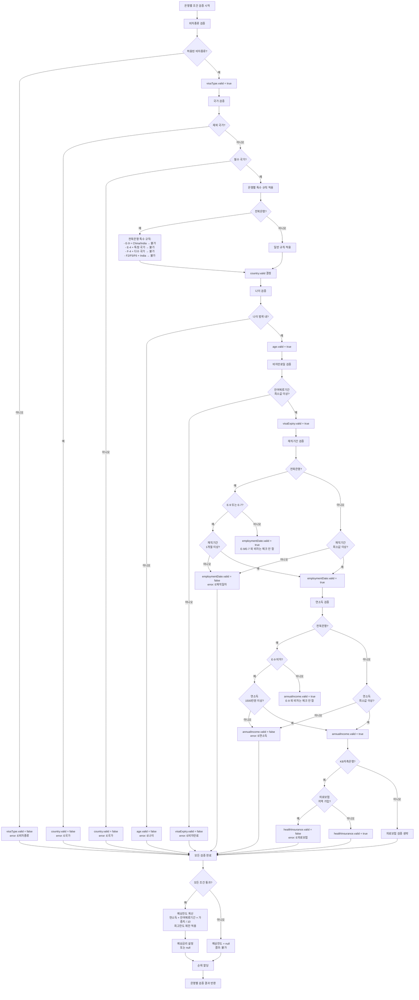
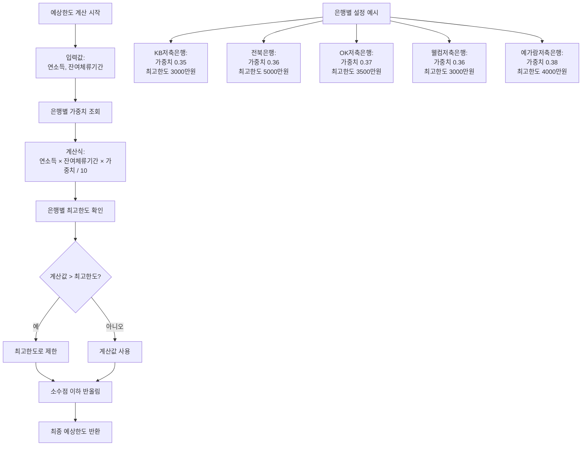
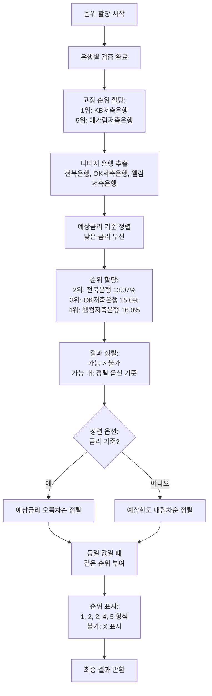

# 금융상품 검색 절차 업무 처리 흐름도

## 1. 대출 조회 프로세스 (loanAppl.html)

```mermaid
flowchart TD
    A[사용자: loanAppl.html 접속] --> B[localStorage에서 login-id 확인]
    B --> C{login-id 존재?}
    C -->|없음| D[로그인 페이지로 리다이렉트]
    C -->|있음| E[대출 조회 폼 표시]
    
    E --> F[사용자 정보 입력]
    F --> G[입력 필드:<br/>- 국가<br/>- 비자종류<br/>- 나이<br/>- 연소득<br/>- 재직기간<br/>- 잔여체류기간<br/>- 의료보험]
    
    G --> H[약관 리스트 로드<br/>GET /server/api/documents/groups]
    H --> I{약관 로드 성공?}
    I -->|실패| J[오류 메시지 표시]
    I -->|성공| K[약관 리스트 표시<br/>[필수]/[선택] prefix 포함]
    
    K --> L[사용자 약관 동의 선택]
    L --> M[조회 버튼 클릭]
    M --> N{필수 약관<br/>모두 동의?}
    N -->|아니오| O[경고: 필수 약관 동의 필요]
    N -->|예| P{모든 필수 필드<br/>입력 완료?}
    
    P -->|아니오| Q[경고: 모든 필드를 입력하세요]
    P -->|예| R[POST /server/api/server/loan-estimate<br/>LoanEstimateServlet 호출]
    
    R --> S[서버: 입력값 검증]
    S --> T{검증 통과?}
    T -->|실패| U[400 Bad Request<br/>모든 필드가 필요합니다]
    T -->|성공| V[비자종류 정규화<br/>E-9 → E9, F-2 → F2]
    
    V --> W[은행별 설정 로드<br/>5개 은행:<br/>KB저축은행, 전북은행,<br/>OK저축은행, 웰컴저축은행,<br/>예가람저축은행]
    
    W --> X[각 은행별 조건 검증]
    X --> Y[은행별 검증 항목:<br/>1. 비자종류 허용 여부<br/>2. 국가 제한/필수 여부<br/>3. 나이 범위<br/>4. 비자만료일<br/>5. 재직기간<br/>6. 연소득<br/>7. 의료보험 KB저축은행만]
    
    Y --> Z[은행별 예상한도 계산<br/>연소득 × 잔여체류기간 × 가중치 / 10<br/>단, 최고한도 초과 불가]
    Z --> AA[은행별 예상금리 설정<br/>또는 null]
    AA --> AB[은행별 순위 할당<br/>1위: KB저축은행<br/>2-4위: 금리 기준 정렬<br/>5위: 예가람저축은행]
    
    AB --> AC[결과 정렬<br/>가능 > 불가<br/>가능 내: 금리/한도 기준 정렬]
    AC --> AD[200 OK<br/>JSON 응답 반환]
    
    AD --> AE[클라이언트: sessionStorage에<br/>결과 저장]
    AE --> AF[결과 표시<br/>displayLoanResult]
    
    AF --> AG[결과 테이블 생성:<br/>- 순위<br/>- 은행명<br/>- 결과 가능/불가<br/>- 신청 버튼<br/>- 예상한도<br/>- 예상금리<br/>- 조건별 O/X 표시]
    
    AG --> AH[정렬 옵션 선택<br/>금리 기준 / 한도 기준]
    AH --> AI[동일 값일 때<br/>같은 순위 부여<br/>1,2,2,4,5 형식]
    
    AI --> AJ{신청 버튼 클릭?}
    AJ -->|예| AK[신청 확인 모달 표시]
    AK --> AL[대출 상담 요청 게시판으로 이동<br/>또는 신청 처리]
    AJ -->|아니오| AM[결과 화면 유지]
```

## 2. 은행별 조건 검증 상세 프로세스



## 3. 대출 상담 요청 게시판 프로세스 (loanDashboard.html)

```mermaid
flowchart TD
    A[사용자: loanDashboard.html 접속] --> B[로그인 상태 확인]
    B --> C{로그인됨?}
    C -->|아니오| D[로그인 페이지로 리다이렉트]
    C -->|예| E[게시판 화면 표시<br/>자동 로드 비활성화]
    
    E --> F[검색어 입력<br/>제목/내용/작성자]
    F --> G[필터 선택<br/>전체/질문/답변/완결/미결]
    G --> H[검색 버튼 클릭]
    
    H --> I[GET /server/api/loan_dashboard<br/>LoanDashboardServlet.listRequests]
    I --> J[쿼리 파라미터:<br/>q: 검색어<br/>req_type: 유형<br/>order: 정렬]
    
    J --> K[DB 쿼리 실행<br/>SELECT FROM loan_dashboard<br/>WHERE 조건<br/>ORDER BY req_id DESC]
    K --> L{검색어 존재?}
    L -->|예| M[WHERE title ILIKE ?<br/>OR content ILIKE ?<br/>OR req_login ILIKE ?<br/>OR name ILIKE ?]
    L -->|아니오| N[검색어 조건 생략]
    
    M --> O[필터 조건 적용]
    N --> O
    O --> P{req_type = 전체?}
    P -->|아니오| Q[AND req_type = ?]
    P -->|예| R[req_type 조건 생략]
    
    Q --> S[결과 조회]
    R --> S
    S --> T[200 OK<br/>JSON 응답<br/>rows 배열]
    
    T --> U[클라이언트: 결과 렌더링]
    U --> V[게시판 테이블 표시:<br/>- ID<br/>- 작성일자<br/>- 작성자<br/>- 유형<br/>- 제목]
    
    V --> W{제목 클릭?}
    W -->|예| X[GET /server/api/loan_dashboard/{id}<br/>LoanDashboardServlet.getRequest]
    X --> Y[상세 정보 조회]
    Y --> Z[상세 패널 표시:<br/>- 제목<br/>- 작성자<br/>- 이름<br/>- 전화번호<br/>- 담당 상담원<br/>- 국적<br/>- 작성일자<br/>- 내용]
    
    W -->|아니오| AA{대출상담요청 버튼 클릭?}
    AA -->|예| AB[작성 폼 표시]
    AB --> AC[localStorage login-id로<br/>사용자 정보 자동 입력]
    AC --> AD[폼 입력:<br/>- 요청자 로그인ID<br/>- 요청자 이름<br/>- 전화번호<br/>- 국적<br/>- 담당 상담원<br/>- 유형<br/>- 제목<br/>- 내용]
    
    AD --> AE{저장 버튼 클릭?}
    AE -->|예| AF{수정 모드?}
    AF -->|예| AG[PUT /server/api/loan_dashboard/{id}<br/>LoanDashboardServlet.updateRequest]
    AF -->|아니오| AH[POST /server/api/loan_dashboard<br/>LoanDashboardServlet.createRequest]
    
    AG --> AI[DB UPDATE 실행]
    AH --> AJ[DB INSERT 실행]
    
    AI --> AK[200 OK<br/>수정 완료]
    AJ --> AL[200 OK<br/>생성 완료]
    
    AK --> AM[목록 새로고침]
    AL --> AM
    AM --> V
    
    Z --> AN{수정 버튼 클릭?}
    AN -->|예| AO[작성자 확인]
    AO --> AP{작성자와<br/>로그인 사용자 일치?}
    AP -->|예| AB
    AP -->|아니오| AQ[권한 없음 메시지]
    
    Z --> AR{삭제 버튼 클릭?}
    AR -->|예| AS[삭제 확인]
    AS --> AT{확인?}
    AT -->|예| AU[DELETE /server/api/loan_dashboard/{id}<br/>LoanDashboardServlet.deleteRequest]
    AT -->|아니오| AV[취소]
    
    AU --> AW[DB DELETE 실행]
    AW --> AX[200 OK<br/>삭제 완료]
    AX --> AM
```

## 4. 예상한도 계산 로직



## 5. 순위 할당 로직



## 6. 주요 컴포넌트 및 역할

### 6.1 클라이언트 측 (HTML/JavaScript)

| 파일 | 역할 |
|------|------|
| `loanAppl.html` | 대출 조회 폼, 약관 동의, 결과 표시, 정렬 옵션 |
| `loanDashboard.html` | 대출 상담 요청 게시판, 검색, 작성/수정/삭제 |

### 6.2 서버 측 (Java Servlet)

| 서블릿 | 엔드포인트 | 역할 |
|--------|-----------|------|
| `LoanEstimateServlet` | `POST /server/api/server/loan-estimate` | 대출 예상한도/금리 계산, 은행별 조건 검증 |
| `LoanDashboardServlet` | `GET /server/api/loan_dashboard`<br/>`POST /server/api/loan_dashboard`<br/>`GET /server/api/loan_dashboard/{id}`<br/>`PUT /server/api/loan_dashboard/{id}`<br/>`DELETE /server/api/loan_dashboard/{id}` | 대출 상담 요청 게시판 CRUD |
| `DocumentsGroupsServlet` | `GET /server/api/documents/groups` | 약관 그룹 리스트 조회 |

### 6.3 데이터베이스

| 테이블 | 컬럼 | 역할 |
|--------|------|------|
| `loan_dashboard` | `req_id`, `req_login`, `counseler`, `name`, `phone_number`, `nationality`, `req_type`, `title`, `content`, `created_at`, `updated_at` | 대출 상담 요청 게시판 데이터 |
| `documents` | `group_name`, `title`, `content`, `select_option` | 약관 문서 데이터 |

## 7. 은행별 설정 상세

### 7.1 KB저축은행
- **순위**: 1위 (고정)
- **허용 비자**: E-7, E-9, F-2, F-6, F-5
- **제외 국가**: Nepal, Cambodia
- **나이**: 19세 이상
- **비자만료일**: 8개월 이상
- **재직기간**: 3개월 이상
- **연소득**: 1500만원 이상
- **의료보험**: 지역 가입 불가
- **예상금리**: 14.7%
- **가중치**: 0.35
- **최고한도**: 3000만원

### 7.2 전북은행
- **순위**: 2위 (금리 기준)
- **허용 비자**: E-7, E-9, F-2, F-6, F-5, F-4
- **제외 국가**: 없음 (특수 규칙 적용)
- **나이**: 19세 이상
- **비자만료일**: 6개월 이상
- **재직기간**: E-9/E-7만 1개월 이상, 그 외 체크 안 함
- **연소득**: E-9만 1500만원 이상, 그 외 체크 안 함
- **예상금리**: 13.07%
- **가중치**: 0.36
- **최고한도**: 5000만원
- **특수 규칙**: E-9 + China/India, F-4 + 다수 국가, F2/F5/F6 + India 등 불가

### 7.3 OK저축은행
- **순위**: 3위 (금리 기준)
- **허용 비자**: E-9
- **나이**: 18세 이상, 45세 이하
- **비자만료일**: 0개월 (체크 안 함)
- **재직기간**: 0개월 (체크 안 함)
- **연소득**: 0만원 (체크 안 함)
- **예상금리**: 15.0%
- **가중치**: 0.37
- **최고한도**: 3500만원

### 7.4 웰컴저축은행
- **순위**: 4위 (금리 기준)
- **허용 비자**: E-9, E-7
- **나이**: 0세 (체크 안 함)
- **비자만료일**: 1개월 이상
- **재직기간**: 0개월 (체크 안 함)
- **연소득**: 0만원 (체크 안 함)
- **예상금리**: 16.0%
- **가중치**: 0.36
- **최고한도**: 3000만원

### 7.5 예가람저축은행
- **순위**: 5위 (고정)
- **허용 비자**: E-7, E-9, F-2, F-6, F-5
- **나이**: 20세 이상
- **비자만료일**: 0개월 (체크 안 함)
- **재직기간**: 0개월 (체크 안 함)
- **연소득**: 0만원 (체크 안 함)
- **예상금리**: 16.5% (고정)
- **가중치**: 0.38
- **최고한도**: 4000만원

## 8. 에러 처리

| HTTP 상태 코드 | 상황 | 메시지 |
|---------------|------|--------|
| 400 | 필수 필드 누락 | "모든 필드가 필요합니다" |
| 400 | 잘못된 ID 형식 | "Invalid ID" |
| 404 | 게시글 없음 | "Not found" |
| 500 | 서버 내부 오류 | "server error" / "Database error" |

## 9. 데이터 흐름

```
대출 조회:
loanAppl.html → LoanEstimateServlet → 은행별 조건 검증 → 예상한도/금리 계산 → 결과 반환 → 화면 표시

대출 상담 요청:
loanDashboard.html → LoanDashboardServlet → PostgreSQL (loan_dashboard) → 결과 반환 → 화면 표시

약관 조회:
loanAppl.html → DocumentsGroupsServlet → PostgreSQL (documents) → 약관 리스트 반환 → 화면 표시
```

## 10. 특수 규칙 및 예외 처리

1. **전북은행 특수 규칙**: 비자종류와 국가 조합에 따른 추가 제한
2. **연소득 2000만원 미만**: 모든 은행의 예상한도를 연소득으로 표시
3. **동일 순위 처리**: 예상금리/예상한도가 동일한 경우 같은 순위 부여
4. **의료보험 검증**: KB저축은행만 의료보험 검증 수행
5. **재직기간/연소득 검증**: 전북은행은 특정 비자종류에만 적용


